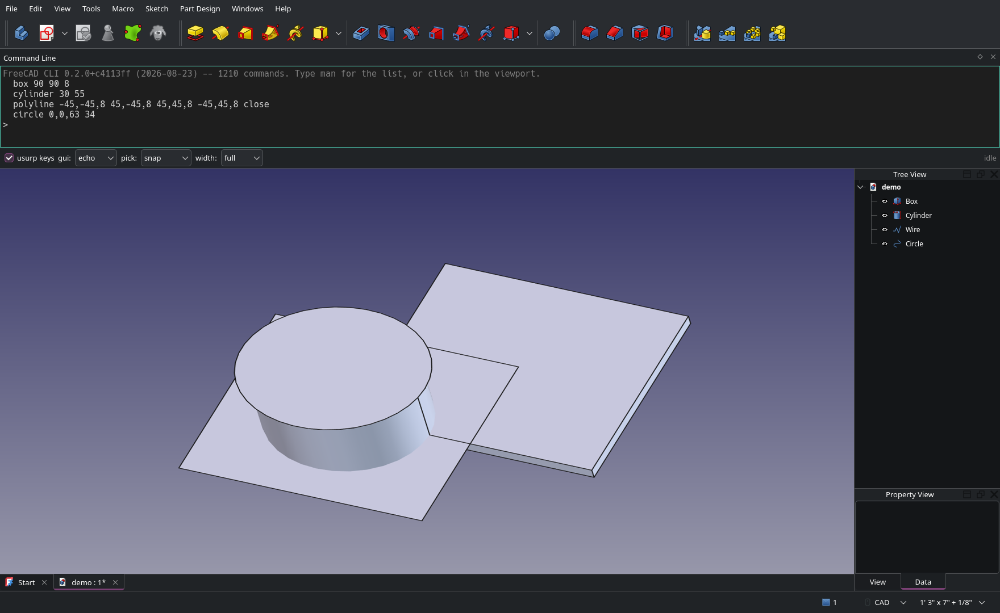
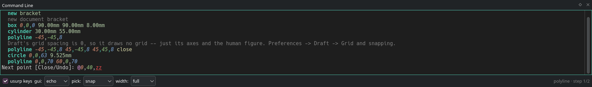
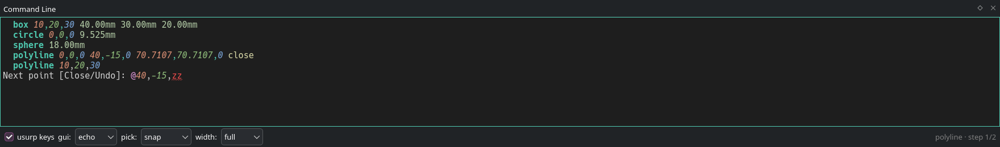
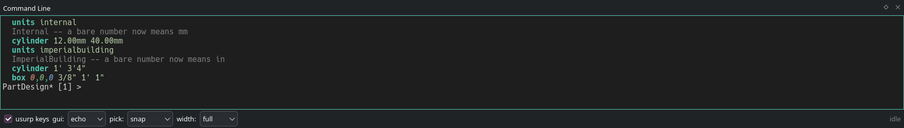
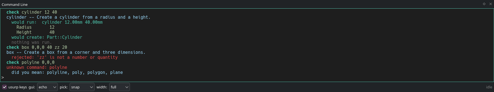
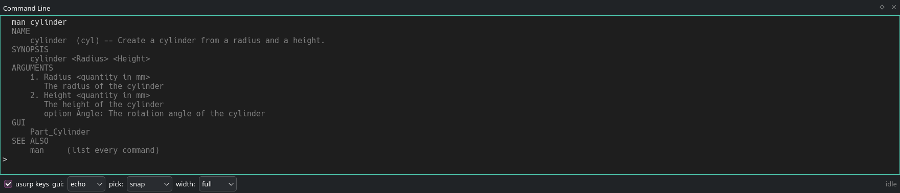
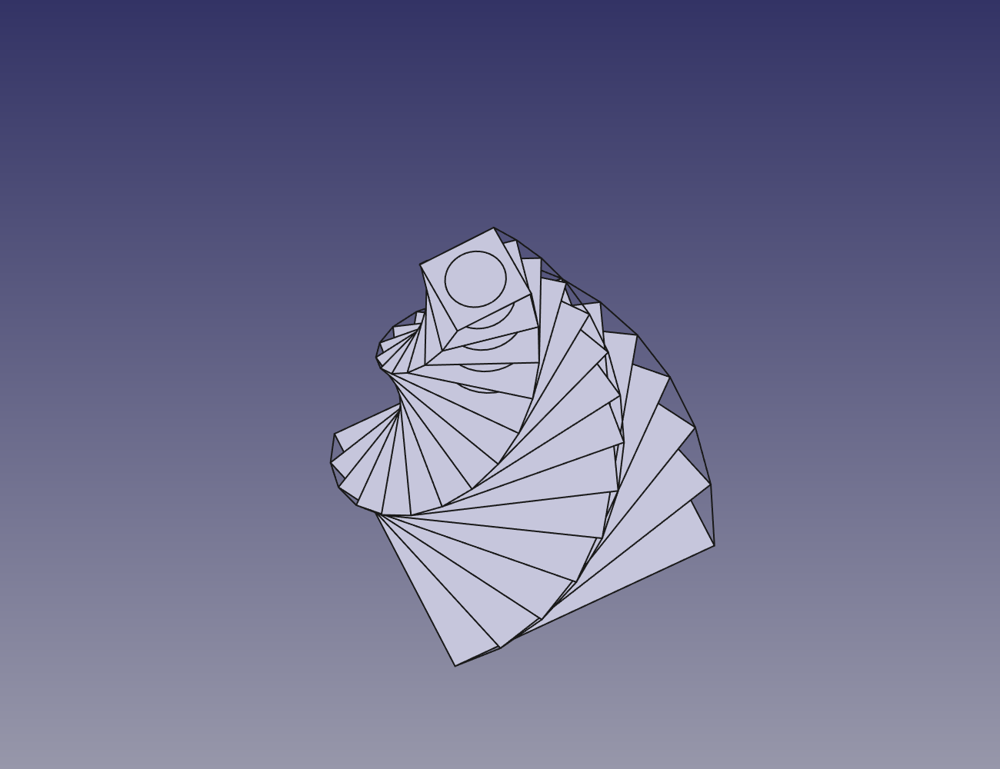

# FreeCAD CLI

A command line for FreeCAD, in the application and in your terminal.



Type a verb, then feed each step a typed coordinate, a viewport pick, or an
option keyword — through the same door, in any order. Every value records its
typed form as it lands, so a command driven half by mouse replays from
history as text.

1111 commands (FreeCAD 1.1.3): a dozen hand-written verbs that pick points
in the viewport, ~210 generated from FreeCAD's type registry, 59 families
that gather a scattered group under one name, and every registered command
as a launcher. Each has a documentation file, seeded from the FreeCAD wiki,
where its name, aliases, preconditions and grouping are tuned by hand.

## How it feels



- The prompt names the current getter and its inline options —
  `Next point [Close/Undo]:`
- The command builds up on **one** accumulating line, not one line per step
- Input is validated as it is typed. `@0,40,` parses; `zz` does not, and
  reddens before Enter

## Colour carries meaning



FreeCAD paints x red, y green and z blue in the viewport. A coordinate on
the command line says the same thing, desaturated so a component never reads
as the error red — which stays saturated and keeps its wavy underline.

Numbers are coloured by dimension, and the dimension comes from FreeCAD:
`Unit.Type` answers `Length`, `Angle`, `Area`, `Mass`, so no table here can
disagree with it.

**Bold is the verb** — the token that decides what every other token means.
**Italic is what the command line supplied rather than you**: a unit taken
from the schema, and a suggestion not yet accepted. Above, `0,0,0` is italic
because the schema supplied its unit; `40.00mm` is upright because it was
stated.

A finished command keeps its colouring in the transcript rather than going
flat once it runs.

## From a terminal

`fccli` is a separate program that talks to a running FreeCAD over a unix
socket. It is not a copy of the command language reached over a wire: the
server subscribes to the same message bus the dock does and calls the same
engine, so there is one registry, one document and one prompt. Start a
command in the terminal and the dock's prompt changes.

**It imports nothing from FreeCAD.** Standard library only, so it runs from
any terminal, any virtualenv, and on a machine where FreeCAD is not on PATH.

```bash
$ fccli start -i                  # from nothing running to a prompt
started FreeCAD, pid 3074336
attached to FreeCAD 3074336.
  detach (or Ctrl+D) leaves this session running.  quit! shuts FreeCAD down.

> box 0,0,0 40 30 20
= box 0,0,0 40.00mm 30.00mm 20.00mm
> polyline
Start of polyline: 0,0,50
Next point [Close/Undo]: @40,0,0
Next point [Close/Undo]: close
= polyline 0,0,50 40,0,50 close
> screenshot ~/bracket.png
/home/you/bracket.png (184 KB)
> detach
detached. FreeCAD 3074336 is still running; fccli attach to come back.
```

The terminal gets the same colours: the server sends the spans, not just the
text, so an axis is an axis and an implied unit is italic in both places.
The prompt is the engine's own, and Tab completions come from the server —
so there is one implementation of what completes, not two.

```bash
$ fccli ls                          # instances, and what each has open
pid 3074336   idle, 1 client(s), floor free
    bracket                4 objects  /home/you/bracket.FCStd
  * scratch                1 objects  (never saved) [unsaved]

$ fccli exec 'cylinder 12 40'       # one-shot
$ fccli check 'sphere zz'           # validate, never run
$ echo 'circle 0,0,0 20' | fccli    # stdin is a script
$ fccli history -f                  # follow, live
$ fccli --json docs                 # what an agent reads
```

A one-shot answers rather than narrating: stdout carries the result, stderr
the reason a command failed, `-v` shows the running echo.

**Exit codes separate "wrong" from "not now".** A rejected command is a
fault — exit 1, reason on stderr. A busy session is ordinary, since someone
using FreeCAD has a dialog open a good fraction of the time — exit **75**
(`EX_TEMPFAIL`), nothing on stderr, deliberately far from 1 so
`if ! fccli exec ...` does not read it as a broken command. `--wait` queues.

With one FreeCAD running, every command attaches to it; `--pid` is only
needed when several are. Bare `fccli` prints the usage and says what it can
reach. [docs/shell.md](docs/shell.md) has the design, including the floor
and the shared buffer still to come.

## Install

FreeCAD 1.0+ (developed against 1.1.3, PySide6).

**Addon Manager** — add this repository as a custom addon source:
`https://github.com/aaronsb/freecad-cli`

**Manually** — clone into FreeCAD's `Mod` directory. FreeCAD 1.1 versions
that path:

```bash
git clone https://github.com/aaronsb/freecad-cli \
  ~/.local/share/FreeCAD/v1-1/Mod/freecad-cli
ln -s ~/.local/share/FreeCAD/v1-1/Mod/freecad-cli/bin/fccli ~/.local/bin/fccli
```

Restart FreeCAD. The command line appears as a full-width strip between the
toolbars and the 3D view. `` Ctrl+` `` toggles it, and it is listed under
**View → Panels → Command Line** like any other dock.

## Using it

| | |
|---|---|
| `pol` + Enter | prefix-unique execution, no Tab needed |
| Tab / Shift+Tab | cycle completions, and walk a remembered command out |
| ↑ ↓ | history, in its assembled form |
| → | accept the ghost suggestion |
| Enter on an empty line | finish a repeating step — or, when idle, repeat the last command |
| Tab on an empty line | recent commands |
| Right-click | repeat the last command, or pick from recent |
| Esc / Ctrl+C | cancel |
| trailing `!` | force past a refusal — `close!` |
| `check <command>` | validate it without running it (`whatif`, `ck`) |

### Coordinates

```
10,20,30      absolute
10,20         z from the previous point
@10,0,0       relative           (AutoCAD spelling)
r10,0,0       relative, alternate spelling
100<45        polar, in the XY plane
3/8in,1in,0   any unit FreeCAD's parser accepts
```

### Units



Display follows FreeCAD's own unit schema, and every conversion goes through
FreeCAD's API — `getUserPreferred` names the unit, `getValueAs` converts.
There is no mapping table here.

```
> units imperialbuilding
> cylinder 12 40                 →  cylinder 1' 3'4"
> box 0,0,0 3/8in 1ft 25.4mm     →  box 0,0,0 3/8" 1' 1"
```

A bare number takes the schema's unit rather than internal millimetres, so
`12` means twelve of whatever you read in. Tab on a bare number appends that
unit, and `units` says what it is.

Schema rendering is meant for reading, not re-parsing: it rounds, and its
compound imperial form (`3" + 7/8"`) does not parse back. Since the echoed
line is also what Up recalls, every rendering is round-tripped before use
and falls back to a precise conversion when it fails.

### The root

`~/.local/share/fccli` is a directory the terminal navigates: `cd`, `ls`,
`pwd`, `cat`, a working directory shared by both terminals. `lib/commands`
is the command tree, `lib/addons/<name>` what each addon ships, `macros`
FreeCAD's own macro directory, and the rest is yours.

A `.fccli` file is a script: YAML frontmatter declaring its arguments and a
body of command lines with `$id` where each argument goes. One in `bin/` is
a verb by file name; elsewhere `run plinth/tower 20` or `./tower 20` runs it
with the arguments inline. A `.FCMacro` runs through FreeCAD's Python
console. [ADR-601](docs/architecture/system/ADR-601-a-root-the-terminal-navigates.md).

The prompt shows where the session is, the way a shell prompt shows the
branch: `PartDesign Body › Sketch* [2] /plinth > ` — the workbench, the
active Body and the object in edit, a `*` when the document is dirty, the
selection count, the working directory, each left out when empty. A command
FreeCAD cannot run here is refused before running, with the reason from its
file. [ADR-300](docs/architecture/surface/ADR-300-the-prompt-shows-where-the-session-is.md).

### Shell builtins

The GUI equivalents route through modal dialogs — Save on an unnamed
document opens a file chooser, closing a modified one asks for confirmation.
These take their arguments inline instead:

```
> save ~/parts/bracket.FCStd     saves there, no dialog
> open ~/parts/bracket.FCStd     new bracket     close     close!
> alias b box                    unalias b       history   history clear
> use sketcher                   commands part   use off
> undo    redo    delete         quit    quit!
> units imperialbuilding         zoom extents / selection    view front / iso
> screenshot ~/shots/plate.png   saves it, and prints the path
```

`close` and `quit` refuse when there is unsaved work rather than raising a
modal; `!` discards. Unsaved state is tracked through
`App.addDocumentObserver`, so it is accurate for edits made anywhere — the
command line, a toolbar, a macro.

`screenshot` prints where it wrote, which is the point: a person can open
the file, and an agent driving the session over the socket can find it
without guessing the name.

### check



`check` resolves and parses a command through the same code path the engine
uses, then stops before emitting — so what it accepts is what would actually
run, rather than a second implementation that drifts. Nothing is created and
no document is required.

### man



`man` lists every command; `man <name>` describes one. `help` is an alias.
Nobody wrote that page — it is generated from FreeCAD's own property
documentation, so every verb has one.

## Where the verbs come from

FreeCAD has no Discovery API. It has a **command registry** that knows names,
labels and grouping but carries no parameters, and a **type registry** that
carries typed, documented properties but says nothing about naming or
invocation. `tools/generate_descriptor.py` harvests both into
`fccli/descriptor.json`, and the factory turns that into four tiers:

| Tier | Count | Source |
|---|---|---|
| 0 | 1111 + | every registered command, as a zero-step verb that runs it — plus whatever FreeCAD registers that the descriptor never saw, at startup and when a workbench opens |
| families | 40 | a group FreeCAD spread apart, as one verb with a choice |
| 1 | ~213 | every parametric type, with steps from its own properties |
| 2 | hand-written + patched | point-picking verbs, ordering, inline options |

Linking a command to the type it builds cannot be done reliably by machine —
name matching puts `BIM_Box` on `Part::Box`, and tracing the call graph puts
`BIM_Tutorial` on `Part::Extrusion`. The design does not need it to: **a type
names and parameterizes its own verb**, so tier 1 stands on the type registry
alone. Command metadata is attached only where the evidence is real.

### What it can drive



Eighty-four commands, 1.8 seconds, no mouse. Fourteen square levels each
rotated 14°, a circle inscribed at each, 52 stringers connecting corners
level to level, and a plinth dimensioned in inches.

None of that is this project's doing. **FreeCAD is built to be driven
programmatically** — every command registered and introspectable, every
object's properties typed and documented, a unit parser that handles
`3/8in`, a snapping engine, a document observer, and a Python console that
can reach all of it. The hard parts were solved by the people who built
that.

What this adds is a way to reach it without writing Python: a grammar over
the registries FreeCAD already publishes, and the terminal conventions —
completion, history, colour, undo, a prompt — that make typing a command
feel like typing a command. It is a wrapper, and it works because there was
something well-made to wrap.

### Families

FreeCAD spreads one idea across many commands with no shared name. Zooming
is `Std_ViewFitAll`, `Std_ViewFitSelection`, `Std_ViewZoomIn`,
`Std_ViewZoomOut` and `Std_BoxZoom`. Sketcher constraints are two dozen
`Sketcher_Constrain*`. As bare launchers each is reachable and none is
discoverable — nothing completes, and there is no way to ask what the
alternatives are.

The family is in the names, so it is read off the registry rather than
listed:

```
> constrain <Tab>
angle  block  coincident  diameter  distance  equal  parallel  perpendicular ...
> view f<Tab>
fit_all  fit_selection  front  fullscreen
```

`Module_CamelCaseRest` splits into a head the family shares and a remainder
naming the member. 59 families are read off the registry, covering ~479
commands; 40 register, the rest yielding to a verb someone wrote. A
single-letter head from a split acronym and FreeCAD's own UI prefixes are
excluded, and a family never takes a name a hand-written or generated verb
already owns.

Where a derived family reads worse than a curated verb, write the verb —
`zoom` is that, gathering commands across two name stems the splitter cannot
join.

### Patches

Shipped tuning lives in the command tree (below). A Python patch remains for
the one thing a data file cannot express: an addon **declaring a verb the
factory cannot generate**, because its objects are `Part::FeaturePython`
with a proxy that FreeCAD's type registry never sees.

```python
PATCH = {
    "key": "CurvedShapes",
    "verbs": {
        "curved_array": {
            "doc": "Array a shape along hull curves.",
            "steps": [{"id": "base", "kind": "selection", "prompt": "Base"}],
            "emit": make_curved_array,   # a callable you supply
        },
    },
}
```

Patches are discovered from three roots, each overriding the last:

```
fccli/patches/*.py                     shipped here
<Mod>/<addon>/fccli_patch.py           shipped by the addon itself
~/.local/share/FreeCAD/fccli/patches/  written by you
```

An addon that drops an `fccli_patch.py` is picked up with no registration.
Its commands already work through tier 0 and gain a documentation file the
first time the tree is generated; the patch is only for verbs the factory
cannot make. `examples/curvedshapes_fccli_patch.py` is a worked example
against a real installed addon.

### The command tree

Every command has a file: `fccli/lib/commands/<workbench>/<Command>.md`,
Markdown with YAML frontmatter. The `generated:` block is the harvest's and
the tool rewrites it; everything below it is yours — `verb`, `aliases`,
`requires`, `panel`, `family`/`choice`, `rank`, `type` — and the body is
the page `man` shows, seeded from the command's page on the FreeCAD wiki.
`make commands` writes what is missing, `make dictionary` compiles the tree
into `fccli/dictionary.json`, and `make lint` refuses a hand edit inside a
generated block. The reasoning is in
[ADR-100](docs/architecture/vocabulary/ADR-100-the-command-dictionary.md).

### Hand-written verbs

Some things want the viewport, not a property sheet. `line`, `polyline`,
`circle`, `move` and `point` are written by hand so they can pick:

```python
REGISTRY.add(Verb(
    name="polyline", aliases=["pl", "pline"], creates="Part::Part2DObjectPython",
    steps=[
        Step("start", POINT, "Start of polyline"),
        Step("next", POINT, "Next point", repeat=True,
             options=[Option("Close", "close the wire", _close),
                      Option("Undo", "drop the last point", _undo_last)]),
    ],
    emit=_emit_polyline,
))
```

The completer, the highlighter, the prompt, `man`, history replay and the
socket all follow from the descriptor.

## Architecture

```
descriptor.json  +  families  +  patches  +  hand-written verbs
        │
        ▼
   verb registry
        │
        ▼
command engine  ── in-process; owns the picker, document, key filter
        │
        ▼
typed message stream   { prompt | live | result | error }
        │
   ┌────┴────────────────┐
   ▼                     ▼
Qt dock                unix socket ──► fccli, and any other client
```

The engine talks to the dock over a stream of typed messages rather than
method calls, which is what lets a socket client be a peer rather than a
copy. A human and an agent share one transcript instead of talking past each
other through write-only RPC.

The key filter is where most of the risk sits: 195 of FreeCAD's 940 default
shortcuts are unmodified keys, so claiming bare printables collides on
purpose. A focus guard keeps real editors' keys, and digits route by step —
`1`–`6` stay the standard views while nothing is running, and become input
once a getter is open.

## Development

```bash
make            # list the targets
make install    # symlink into FreeCAD's Mod directory
make check      # compile, version-check, test  (offscreen, no GUI)
make bvt        # drive a real FreeCAD GUI end to end, unattended
make socket     # drive a real FreeCAD from outside, over the socket
make check-all  # all three
make descriptor # regenerate fccli/descriptor.json
make screenshot # recapture docs/images
make bump PART=minor
make release    # stamp the commit, tag, push, cut a GitHub release
```

`make check` covers the grammar offscreen. `make bvt` covers what only a
running GUI can: the dock, the application-level key filter, the picker, the
factory loading at startup, undo through real transactions, and the shutdown
path. `make socket` launches FreeCAD through `fccli start` and drives it from
outside. All three run unattended, and a missing result file is reported as
a failure rather than mistaken for success.

The version prints in the banner as `0.2.0+c4113ff (2026-08-23)` — semantic
version, the commit it was built from, and that commit's date. Running from
a checkout the commit is read live from git and marked `-dirty` when the tree
has changes; a released copy carries a stamped `fccli/_build.py`.

## Documentation

| | |
|---|---|
| [docs/conventions.md](docs/conventions.md) | every rule the command line follows, in one place |
| [docs/addons.md](docs/addons.md) | adding command-line support to an addon |
| [docs/shell.md](docs/shell.md) | the terminal client's design |
| [docs/state.md](docs/state.md) | the engine and the six machines around it: states, transitions, invariants |
| [docs/architecture/](docs/architecture/INDEX.md) | decision records, by domain |
| [FINDINGS.md](FINDINGS.md) | what was learned about FreeCAD's internals |
| [CHANGELOG.md](CHANGELOG.md) | releases |

## Status

Working, and in use. [CHANGELOG.md](CHANGELOG.md) tracks releases.
[FINDINGS.md](FINDINGS.md) records what was learned about FreeCAD's
internals along the way, including several things not documented anywhere
obvious.

## License

LGPL-2.1-or-later -- see [LICENSE](LICENSE). The same license FreeCAD
itself uses, so this code can move into FreeCAD without a relicensing
step, and a fork that changes it has to publish the changes.
