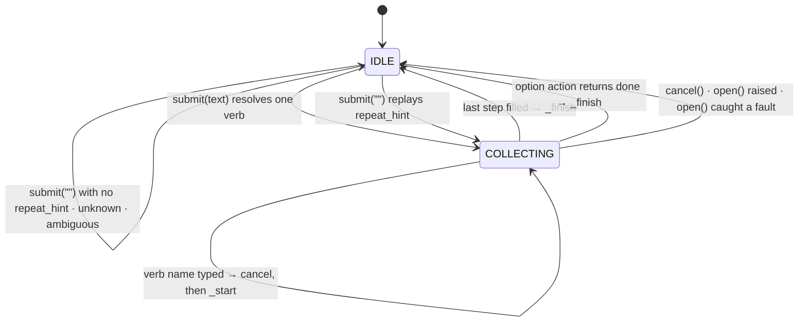
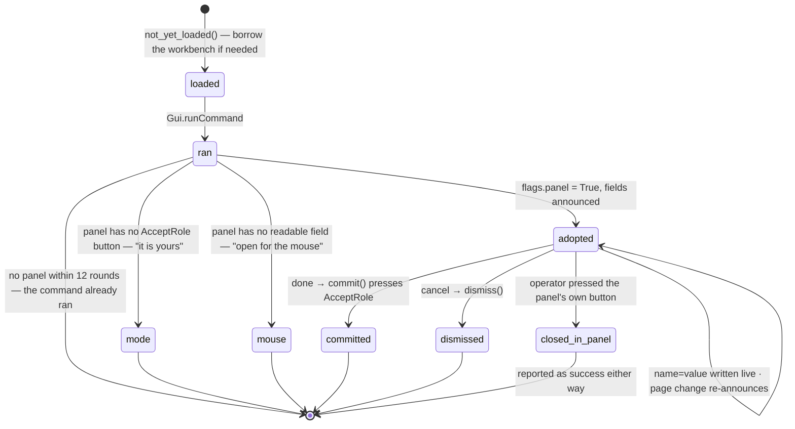

# State

*2026-08-24. Design note: the state machines as the code holds them,
written so the next change can be checked against them. Read with
`fccli/engine.py`, `panels.py`, `picking.py`, `modals.py`, `keyfilter.py`,
`server.py`, `session.py` and `actions.py`.*

One engine drives everything. Around it sit six smaller machines, each
owning one concern — the panel, the picker, the modal filter, the key
filter, the socket floor, the toolbar bridge — and each reads the engine's
state rather than keeping a copy.

## The engine

Two states and one flag.

`state` is `IDLE` or `COLLECTING`. `driving` is orthogonal: true for the
length of `open()` and of `emit()`, and nothing else. `_finish` resets to
`IDLE` *before* calling `emit`, so while a command is actually running the
engine reads idle. Anything asking "did the command line cause this" — the
bvt dialog watchdog, the socket's busy check — reads `driving`.

`bus.STATE` is declared and has never been emitted. Idle is announced as
`PROMPT` with `idle=True`.

### Starting

`_start` resolves the first token by prefix. No hit or more than one hit
is an error and the engine stays idle. A trailing `!` sets `flags.force`.
Then, in order:

1. `state = COLLECTING`, `values`, `done`, `replay`, `picked` cleared,
   `steps = None` (the verb's declared steps stand).
2. If the verb has `open` and the engine is not dry: `driving = True`,
   modals armed, `open(engine)`. An exception or a caught fault aborts the
   verb, resets, and reports. A list returned becomes `steps` — the verb
   learned what to ask by starting.
3. Inline tokens are fed one at a time, each to the pending step whose
   kind matches it (`_step_for_token`). A `raw` step takes the rest of the
   line whole.
4. Finish early when the line was already a whole command: a panel verb
   given any value, or a declared verb with only optional or defaulted
   steps left. Never a panel verb given nothing — every panel field is
   optional and finishing would commit it unread.
5. Otherwise `_announce`.

### Filling

`pending()` is every step in prompt order (`order_of`: points last) that
is not filled. A step is filled when its id is in `done`, or it has a
value and is not `repeat`. A repeating step is never filled by a value;
bare Enter ends it once `min_count` is met.

`_feed_text` on a `COLLECTING` engine:

- `_is_restart` first. A token that cannot be read as input for the open
  step — not an option, not a parsable point or quantity, not a declared
  choice, not an existing object label — and that resolves to exactly one
  verb cancels the current verb and starts that one.
- An option prefix runs the option's action. `True` means finish.
- Otherwise parse by kind and `_accept`.

`_accept` records the value, appends the typed form to `replay`, marks
`picked` when it came from the viewport, then calls `on_accept` if the
step has one. A complaint takes the value back — `values`, `done`, and
the replay token — and reports. Then finish if nothing is pending, else
announce.

Bare Enter (`_terminate_step`): a repeating step ends if `min_count` is
met; a `SELECTION` step takes FreeCAD's current selection or complains
that nothing is selected; a step with a default takes it; an optional
step records `None`; anything else is "required".

`_announce` emits `PROMPT` for the current step. A `SELECTION` step with a
selection already made is accepted on the spot rather than asked for. A
`POINT` step starts the picker; any other step stops it.

### Finishing

`_finish` captures `verb`, `values`, `flags`, `replay`, `picked`, computes
`typed_prefix` (the replay up to the first picked token), stops the
picker, resets, and sets `repeat_hint` to the typed prefix so Enter places
the next one with a fresh click. A dry engine emits `RESULT` with
`dry=True` here and stops.

Otherwise: open a transaction unless the verb is non-transactional or a
panel is open; `driving = True`; modals armed; `emit(values)`. An
exception aborts the transaction, tells the verb to clean up by name
(`_abort_as`, since `self.verb` is already cleared), and reports. A caught
fault aborts the transaction and reports. Success commits, relays any
notices, and emits `RESULT` with the replay text.

### Transactions

One typed line is one undo step. `UndoMode` is switched on and
`openTransaction(replay)` called per line. Skipped when the verb says
`transactional=False` or `flags.panel` is set — a panel keeps its own
undo. Commit and abort check the document is still the active one, since
a verb may have switched or closed it.

## The panel

A tier-0 verb has no declared steps and an `open` that runs the command
and reads whatever opened.

The adopted panel is one repeating `TEXT` step, `set`, `raw`, with
`min_count=1`, one option `done`, and `on_accept=_assign`. Each line is
split into `name=value` pairs and every pair is written to its field
before any complaint is reported, so a line that half-worked does not go
into history as if it had all worked. A choice that changes the page
re-announces the fields.

`_emit_panel` finishes it: `commit()` presses by `AcceptRole`, never by
label; a panel that stays open after (Part_Primitives creates repeatedly)
gets the dismiss button too. `_abort_panel` dismisses on cancel.

The gap is `closed_in_panel`. The engine cannot tell the panel's OK from
its Cancel; both read as "the panel was closed in the panel" and the verb
reports success, puts `RESULT` on the bus, and writes a line to history
that replays. That is task #3, and it is runtime state — nothing in the
[dictionary](command-dictionary.md) can answer it.

## The picker

Stopped or started, and the engine decides which on every announce: a
`POINT` step starts it with the last point placed, any other step stops
it. Three backends share the contract `start(callback, last)` / `stop()`:

- `snap` registers viewport callbacks and asks Draft's Snapper for the
  point; without a Snapper it degrades to raw.
- `getpoint` hands the whole job to `Gui.Snapper.getPoint`, which opens
  Draft's own point task and re-arms after each pick until stopped.
- `raw` is the viewport's `getPoint` with no snapping.

A pick arrives at `feed_point`, which ignores it unless the current step
is a `POINT`.

## Modals

A single process-wide event filter and a stack of `Caught` targets; the
innermost armed block answers a dialog. Armed twice per command — around
`open()` and around `emit()` — and only then. A dialog with an
Information icon is a notice: recorded, dismissed, the command carries on.
One button otherwise is a rejection: recorded as `fault`, and the engine
reports it as an error the way it reports a bad quantity. Several buttons
is a question, refused unless the line carried `!`, in which case the
destructive answer is taken. A file chooser is refused with the reason.

## Keys

`should_usurp` is a function of the key, the engine, and the pending
input text. First the filter stands down entirely when a modal or popup
is up, when focus is on the command line itself, or when focus is in any
editor widget. Then:

| Key | Goes to the command line when |
|---|---|
| modifier alone, Alt/Meta chord, F1–F35 | never |
| Space (the passthrough set) | `state != idle` or text pending |
| Ctrl chord | `claim_readline` and the key is a readline binding |
| digit | `wants_numeric()` (a `POINT` or `QUANTITY` step is open) or text pending |
| Enter, Escape, navigation, editing | `state != idle` or text pending |
| any other printable | always |

The digit rule and the passthrough rule are the same rule read twice: a
bare key belongs to FreeCAD while the line is empty and idle. Task #4 is
the cost — a panel verb holds `COLLECTING` for minutes, and Space stops
being FreeCAD's visibility toggle the whole time.

## The socket floor

The shared line has a holder or none. `claim` succeeds when the floor is
free, held by the same client, not busy, or stolen; `!` on the first token
steals. `release` clears the holder and the shared buffer.

`submit` from a client: refuse if busy, claim the floor (stealing if
forced), run the line, collect everything the bus said, then release the
floor only if the engine is idle afterwards — a collecting engine keeps
the floor so the next line from that client is input rather than a
competing command.

Busy has two reasons. `modal`: a task panel is open, the engine is idle
and not driving — someone else's panel. `floor`: another client holds it.
A panel the command line opened is not busy; the engine is collecting.

`cancel` from a client is Escape from outside: a collecting or driving
engine is cancelled; otherwise an open task panel is dismissed; otherwise
nothing. `state` returns document, engine state, verb, step, prompt,
options, floor and scope, and `bin/fccli` renders its prompt from that.

## The toolbar bridge

`ActionBridge` connects to every `QAction` and rescans when the workbench
selector changes. A click reaches `_on_trigger` and the mode decides:

| Mode | What a click does to the command line |
|---|---|
| `echo` | writes `> verb (alias)` to the scrollback and suggests neighbours |
| `ghost` | puts `verb ` on the input line, ready for arguments |
| `follow` | submits the verb, unless it is in `disabled_verbs` |
| `off` | nothing |

## What is not here yet

The prompt shows the engine's step and nothing of FreeCAD's: not the
workbench, not the active Body or the sketch in edit, not whether the
document is dirty. Task #4 adds a `context` message — the never-emitted
`STATE` kind is the natural slot — emitted on workbench change (the
`WbSelector` hook already exists in `actions.py`), document change,
selection change and after every emit, rendered by the dock and by
`bin/fccli` alike. The [dictionary note](command-dictionary.md) says what
that context means for which commands are offered first.
