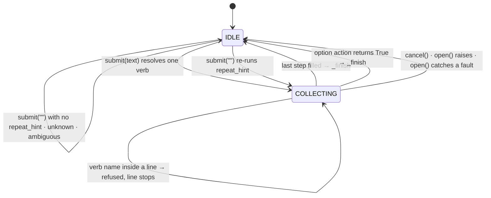

# State machines

The command engine is the one stateful component. Six smaller machines
surround it — the task panel, the picker, the modal filter, the key
filter, the socket floor, and the toolbar bridge — and each reads the
engine's state rather than holding a copy. This document describes each
machine: its states, the events that move it, and the invariants the rest
of the code depends on.

Source: `fccli/engine.py`, `panels.py`, `picking.py`, `modals.py`,
`keyfilter.py`, `server.py`, `session.py`, `actions.py`, `bus.py`.

## Engine

### States

| Field | Values | Meaning |
|---|---|---|
| `state` | `IDLE`, `COLLECTING` | whether a verb is open and taking input |
| `driving` | int | above zero while `open()` or `emit()` is executing; a counter, since a script's `emit` runs other lines through the engine |
| `verb` | `Verb` or `None` | the open verb |
| `steps` | list or `None` | steps discovered by `open()`; `None` means the verb's declared steps apply |
| `values`, `done` | dict, set | collected values; step ids that need no more input |
| `replay`, `picked` | list, list | the typed form of every value; indices of values that came from the viewport |
| `flags` | dict | `force`, `panel`, and any option flags |
| `repeat_hint` | str or `None` | the line an empty Enter re-runs |
| `suppress_record` | int | above zero while a script runs its lines; a `RESULT` emitted then carries `record=False` |

`driving` is independent of `state`. `_finish` resets `state` to `IDLE`
before calling `emit`, so the engine reads idle for the whole of a
command's execution. Code that needs to know whether the command line
caused an event — the bvt dialog watchdog, the socket's busy check — reads
`driving`.

Idle is signalled as a `PROMPT` message with `idle=True`. The session
answers it with `STATE` (ADR-300): the workbench, the active Body or Part
and the object in edit, dirtiness, the selection count and `cwd`, with
the rendered segment as the text. The session also emits `STATE` when a
workbench activates, the selection changes, or a document's dirtiness
changes. Both terminals render their idle prompt from it.

### Transitions

### Start

`_start(text)`:

1. Resolve the first token by prefix against the registry. A token that
   matches nothing and contains `/` or starts with `.` is a path, and the
   line becomes `run <token> …`. Zero or more than one match otherwise is
   an error; the engine stays `IDLE`. A trailing `!` sets `flags.force`.
2. `state = COLLECTING`; clear `values`, `done` and `picked`; seed
   `replay` with the verb name; set `steps = None`; emit `LIVE`.
3. If the verb defines `open` and the engine is not dry: set `driving`,
   arm the modal filter, call `open(engine)`. A tier-0 verb's `open`
   asks `Gui.Command.isActive()` first and, unless the line carried `!`,
   refuses with the command file's `requires` as the reason (ADR-300). An exception or a caught
   fault aborts the verb, resets, and reports an error. A returned list
   becomes `steps`.
4. Feed each remaining token to the pending step whose kind matches it
   (`_step_for_token`). A token that will not parse there and names a
   verb (`_verb_at_step`) is refused with an error, and the line stops:
   one submitted line is one command (ADR-201). A step marked `raw` takes
   the rest of the line as one value.
5. Finish immediately when the line was a complete command: a verb with
   discovered steps that received at least one value, or a verb with
   declared steps whose remaining steps are all optional or defaulted. A
   verb with discovered steps and no values does not finish here.
6. Otherwise announce the current step.

### Input

`pending()` returns the unfilled steps in prompt order. `order_of` sorts
`POINT` steps last. A step is filled when its id is in `done`, or when it
has a value and is not `repeat`. A repeating step is filled only by `done`.

`submit(text)` while `COLLECTING` calls `_feed_text`:

1. Resolve the step the text belongs to. With no pending step the text is
   dropped without a message.
2. `_verb_at_step`: on a step that is not `raw`, `TEXT` or `PATH`, a
   token that cannot be read as input for it — not an option prefix, not
   a parsable point or quantity, not one of the step's choices, not the
   label of an existing object — and that resolves to exactly one verb
   names that verb. A `raw`, `TEXT` or `PATH` step accepts any text, so
   no verb name is read out of one; an adopted panel is such a step.

   This is the prompt door, and here the name means a restart: `_restart`
   cancels the current verb and starts the named one. The other door is
   the rest of a submitted line, which `_start` walks itself and where
   the same token is refused (ADR-201).
3. If the token is a prefix of one of the step's options, run its action.
   An action returning `True` finishes the verb.
4. Otherwise parse by the step's kind and call `_accept`.

`_accept(step, value, typed)`:

1. Record the value (`values[step.id] = value`, or append for a repeating
   step); add the step to `done` unless it repeats; append `typed` to
   `replay`; record the index in `picked` when the value came from the
   viewport.
2. If the step has `on_accept`, call it. A returned complaint reverses
   step 1 and reports an error.
3. Finish if `pending()` is empty; otherwise announce.

`submit("")` while `COLLECTING` calls `_terminate_step`:

| Current step | Result |
|---|---|
| repeating, `min_count` met | mark done; finish or announce |
| repeating, `min_count` not met | error |
| `SELECTION` | accept FreeCAD's current selection; error if empty |
| has `default` | accept the default |
| `optional` | record `None`; mark done |
| otherwise | error: required |

`feed_point(vec)` accepts a viewport pick only when the current step is a
`POINT`; otherwise it is dropped.

### Announce

`_announce` emits `PROMPT` for the current step. Two special cases:

- A `SELECTION` step with a non-empty current selection is accepted
  without prompting.
- A `POINT` step starts the picker with `last_point()`; any other step
  stops it. No current step emits `PROMPT` with `idle=True` and stops the
  picker.

### Finish

`_finish`:

1. Capture `verb`, `values`, `flags`, `replay`, `picked`; compute
   `typed_prefix` (the replay up to the first picked value).
2. Stop the picker; `_reset` (state to `IDLE`, all collection fields
   cleared); set `repeat_hint` to the typed prefix, or the full replay
   when nothing was picked.
3. Dry engine: emit `RESULT` with `dry=True` and return.
4. Open a transaction unless the verb is `transactional=False` or
   `flags.panel` is set.
5. Set `driving`, arm the modal filter, call `emit(values)`.
6. On exception: abort the transaction, call the verb's `abort` by name
   (`self.verb` is already cleared), emit `ERROR`.
7. On a caught fault: abort the transaction, emit `ERROR`.
8. Otherwise: commit the transaction, emit each caught notice as `INFO`,
   emit `RESULT` with the replay text.
9. `_report_rejected`: the objects the active document has marked
   `Invalid` are read before `emit` and again after, and anything in the
   delta is an `ERROR` beside the `RESULT` — the line ran, and what it
   made is not usable (ADR-202). Skipped when the verb switched or closed
   the active document, there being nothing to compare against.
10. Clear `driving`; announce.

### Cancel

`cancel()` on a `COLLECTING` engine calls the verb's `abort`, stops the
picker, resets, and emits `INFO`. On an `IDLE` engine it does nothing —
including during `emit()`, when `driving` is set and `state` is already
`IDLE`.

### Scripts

A script verb's `emit` runs the file's lines through `submit`, one at a
time, from inside `_finish`. The engine is `IDLE` when `emit` starts, so
each inner line runs a full `_start` → `_finish` of its own: its own
transaction, its own modal arming, its own `RESULT` with `record=False`.
`driving` counts, so it stays above zero for the whole of the outer
`emit`. The runner stops at the first inner `ERROR` or at an inner line
that leaves the engine `COLLECTING`, cancelling it either way, and its
`finally` cancels whatever is still open. The script call is the one
recorded `RESULT`, and the runner restores `repeat_hint` to the script
call after the inner lines overwrote it. `script_depth` stops a script
that runs itself at eight.

### Transactions

One submitted line is one undo step. `_open_transaction` sets
`doc.UndoMode = 1` and opens a transaction named by the replay text.
Commit and abort are no-ops when the document is no longer the active
one, since a verb may switch or close documents.

## Task panel

A tier-0 verb has no declared steps and an `open` that runs the command
and inspects whatever it opened.

```mermaid
stateDiagram-v2
    [*] --> loaded : not_yet_loaded() borrows the owning workbench if the command is absent
    [*] --> failed : command absent and its workbench could not load it → open() raises
    loaded --> ran : Gui.runCommand
    ran --> [*] : no panel within 12 event-loop rounds
    ran --> mode : no accepting button
    ran --> mouse : no readable field
    ran --> adopted : flags.panel = True; fields announced
    adopted --> adopted : name=value written to the field · page change re-announces
    adopted --> committed : done → commit()
    adopted --> failed : done → commit() finds no button → dismiss(), emit raises
    adopted --> dismissed : cancel → dismiss()
    adopted --> closed_in_panel : operator pressed a panel button
    mode --> [*]
    mouse --> [*]
    committed --> [*]
    dismissed --> [*]
    failed --> [*]
    closed_in_panel --> [*]
```

An accepting button is one with role `AcceptRole`, `ApplyRole` or
`YesRole`, or a plain button labelled `ok`, `create` or `apply`.

Exit paths from `ran` other than `adopted` return `None` from `open`; the
verb then has no steps and `_finish` runs `_emit_panel`, which returns
immediately because `flags.panel` is unset. The command has already
executed by then. The `mode` and `mouse` exits leave the panel open with
the engine `IDLE`.

An adopted panel yields one step: `set`, kind `TEXT`, `raw`, `repeat`,
`min_count=1`, option `done`, `on_accept=_assign`. `_assign` splits the
line into `name=value` pairs, writes every pair before reporting any
complaint, and re-announces the field list when a write changes which
fields the panel shows. Values are written as typed; the panel's own
parser reads them.

`_emit_panel` finishes an adopted panel: `commit()` presses the first
button found by role in `AcceptRole`, `ApplyRole`, `YesRole`, and failing
that the first plain button labelled `ok`, `create` or `apply`. If the
panel remains open (Part_Primitives creates and stays open), a button
labelled `cancel` or `close` is pressed. `_abort_panel` calls `dismiss()`
on cancel.

A panel closed by the operator while adopted is not detected until the
next line: a `name=value` line answers "the panel has closed" and the
engine stays `COLLECTING`; `done` reaches `_emit_panel` with `is_open()`
false. OK and Cancel are indistinguishable at that point; both are
reported as "the panel was closed in the panel" and the verb completes
with `RESULT` on the bus and a replayable line in history.

No transaction wraps a panel verb; the panel's own undo covers it.

## Picker

Two states, stopped and started. `_announce` decides on every step: a
`POINT` step starts the picker with the last placed point; any other
step, `_finish`, `cancel`, and a restart stop it.

| Backend | Mechanism |
|---|---|
| `snap` | viewport event callbacks; `Gui.Snapper.snap` resolves the point; degrades to raw when no Snapper is available |
| `getpoint` | `Gui.Snapper.getPoint` with a callback; re-arms after each pick until stopped; Escape inside the Snapper stops re-arming without informing the engine, which stays at the `POINT` step |
| `raw` | viewport event callbacks; `view.getPoint` with no snapping |

All three implement `start(callback, last)` and `stop()`. A pick calls
`engine.feed_point`.

## Modal filter

One application-level event filter, installed on first use, with a stack
of `Caught` targets. The innermost armed block answers a dialog. The
engine arms it twice per command, around `open()` and around `emit()`.

| Dialog | Handling |
|---|---|
| Information icon | recorded as a notice; dismissed; the command continues |
| one button with role `AcceptRole` or `YesRole`, any other icon | a rejection: recorded as a fault; dismissed; the engine reports an error |
| one button with any other role | treated as a question |
| several buttons | a question: recorded as a fault whatever the answer. The `RejectRole` button is pressed, or the `DestructiveRole` button when `flags.force` is set; in both cases the engine aborts the transaction and reports an error |
| file chooser | refused with the reason |

Buttons are identified by role. Button text is translated and never
compared.

## Key filter

`should_usurp(ev)` decides whether a key press reaches the command line.
The filter stands down when a modal or popup widget is active, when focus
is on the command line, or when focus is in a `QLineEdit`, `QTextEdit`,
`QPlainTextEdit`, `QAbstractSpinBox`, or `QComboBox`.

| Key | Reaches the command line when |
|---|---|
| modifier alone; Alt or Meta chord; F1–F35 | never |
| Space (the passthrough set) | `state != IDLE`, or input text is pending |
| Ctrl chord | `claim_readline` is set and the key is a readline binding |
| digit | `wants_numeric()` — a `POINT` or `QUANTITY` step is open — or input text is pending |
| Enter, Escape, navigation, editing | `state != IDLE`, or input text is pending |
| other printable | always |

A bare key belongs to FreeCAD while the line is empty and the engine is
idle. While a verb is collecting, Space, digits, and Enter belong to the
command line for the whole of the collection, including a panel verb
held open across many lines.

## Socket floor

The shared input line has one holder or none.

| Op | Effect |
|---|---|
| `claim(who, steal)` | succeeds when the floor is free or held by `who`; displaces the holder when `steal` is set or the session is not busy; otherwise refused with the holder's name |
| `release(who)` | clears the holder and the shared buffer if `who` holds it |
| `set_buffer(who, text)` | claims the floor for `who` and publishes the partial line; a blank buffer while the engine is idle releases the floor |

A client's disconnect releases any floor it held.

`busy()` is `engine.state != IDLE` or a non-blank shared buffer.

The session also holds `cwd`, the terminal's place in the root directory
(ADR-601): a virtual path under `~/.local/share/fccli`, `/` at start,
moved by `cd` from either terminal and shown in both prompts. `cd`
resolves against it and cannot leave the root.

`submit` from a client: return a `busy` reply if `_busy()` says so; claim
the floor, stealing when the first token ends in `!`; run the line;
collect every bus message it produced; release the floor if the engine is
`IDLE` afterwards. A collecting engine keeps the floor so the client's
next line is input for the open verb.

`_busy()` returns `modal` when `Gui.Control.activeDialog()` is set while
the engine is idle and not driving. That covers a panel the operator
opened and a panel the command line opened but did not adopt — the
`mode` and `mouse` exits above. An adopted panel leaves the engine
collecting and is not busy. `floor` is returned when another client holds
the line.

`cancel` from a client: when the engine is collecting or driving,
`engine.cancel()` is called and the reply says `command`; during `emit()`
the engine is already `IDLE` and the call does nothing. Otherwise an open
task panel is dismissed; otherwise nothing.

`state` returns the active document, the engine state, the open verb,
step, prompt and options, the floor, and the scope. `bin/fccli` renders
its prompt from this reply.

## Toolbar bridge

`ActionBridge` connects to the `triggered` signal of every `QAction`
under the main window and rescans when the workbench selector changes.
Actions persist across workbench switches; the connection map is never
pruned.

| Mode | On a toolbar click |
|---|---|
| `echo` | write `> verb (alias)` to the scrollback; suggest neighbours |
| `ghost` | place `verb ` on the input line |
| `follow` | `engine.submit(verb)`, unless the verb is in `disabled_verbs` |
| `off` | nothing |

A command with no verb in the registry is echoed under its command name
in every mode except `off`.
