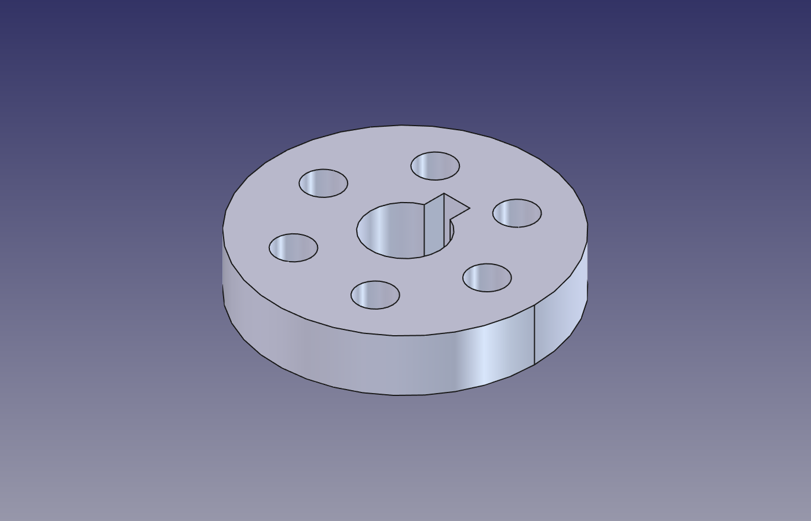
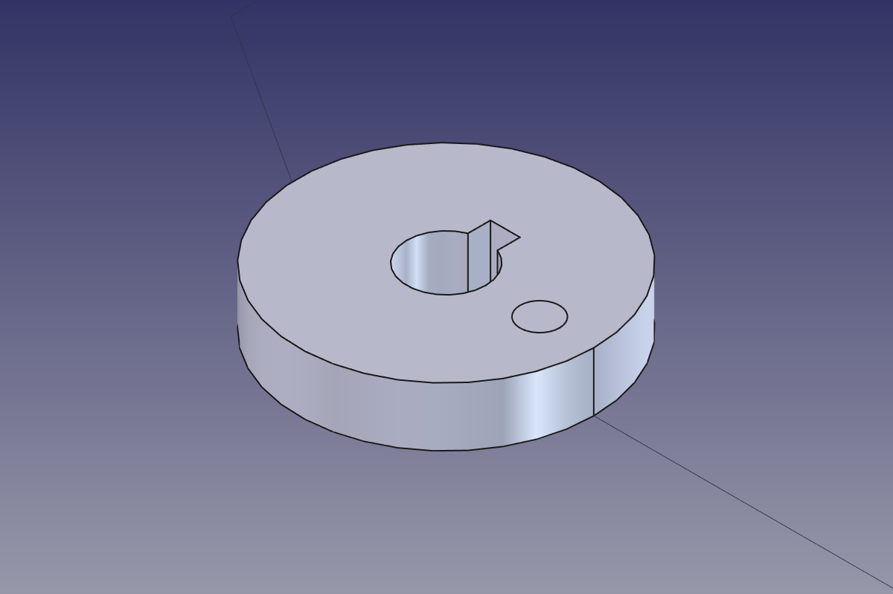
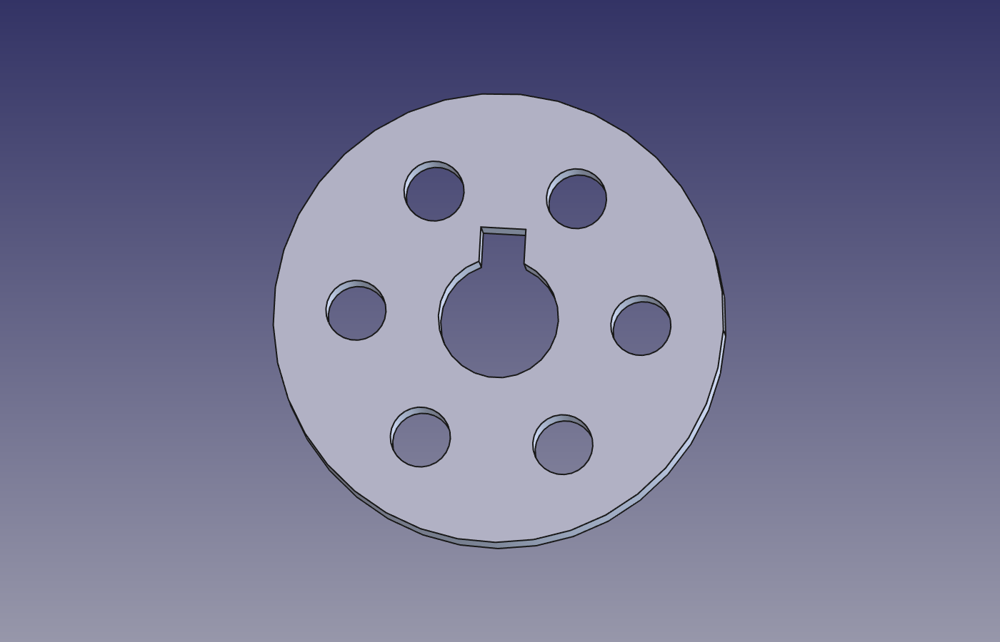
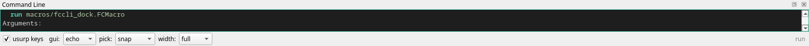

# A trial from the outside

A session on 2026-08-27, driving a running FreeCAD over the socket with
`bin/fccli`, the way someone would who had read `help` and nothing else.
The question was whether the command set is comprehensible: can a person
find the verb, read its manual, type the line, and understand the reply.
The part built along the way is a pulley hub — a bored disc with a keyway
and six holes on a bolt circle — from primitives and booleans alone.



## Finding the way in

`help` lists the 34 hand-written verbs with a one-line doc each and points
at `man` for the 1358 generated ones. `commands` lists 25 domains by size;
`commands part` lists the 97 in one. `man cylinder` reads as a manual page:
name, synopsis, typed arguments with units, a verified example, the wiki
body, the GUI placement, and a `SEE ALSO` line.

```
$ fccli exec 'man cylinder'
NAME
    cylinder  (cyl) -- Create a cylinder from a radius and a height.
SYNOPSIS
    cylinder <Radius> <Height>
ARGUMENTS
    1. Radius <quantity in mm>
       The radius of the cylinder
    2. Height <quantity in mm>
       The height of the cylinder
       option Angle: The rotation angle of the cylinder
EXAMPLE
    cylinder 12 40
    verified 2026-08-26 on FreeCAD 1.1.3
...
SEE ALSO
    primitive, box, cone, part_sphere, part_torus, tube
```

Two things a first reading got wrong. `man cut` is the Mesh PolyCut; the
Part boolean is `part_cut`, found through `commands part`. `man fit` lands
on `zoom` (`fit` is its alias), and the isometric view is `view iso`, a
choice inside the `view` family — `man view` lists the 36 choices by group.

## Building the hub

Every line below was typed as shown. The reply is the line after it.

```
new                              new document Unnamed
cylinder 30 12                   = cylinder 30.00mm 12.00mm
cylinder 8 12                    = cylinder 8.00mm 12.00mm
select Cylinder, Cylinder001     selected Cylinder, Cylinder001
part_cut                         = part_cut
box -3,4,0 6 8 12                = box -3,4,0 6.00mm 8.00mm 12.00mm
select Cut, Box                  selected Cut, Box
part_cut                         = part_cut
cylinder 4 12                    = cylinder 4.00mm 12.00mm
move Cylinder002 0,0,0 19,0,0    = move Cylinder002 0,0,0 19,0,0
```



Five more holes the same way, at 60° steps around the 19 mm circle, then:

```
select Cylinder002, Cylinder003, Cylinder004, Cylinder005, Cylinder006, Cylinder007
part_union                       = part_union
select Cut001, Fusion            selected Cut001, Fusion
part_cut                         = part_cut
describe Cut002
    type             Part::Cut
    volume           27.60 ml
    surface area     93.82 cm^2
    vertices         24    edges  35    faces  13
```



`describe` bare lists the document with a bounding box per object;
`describe <name>` reads one out — identity, placement, properties, shape,
and what uses it. That pairing carried the whole session: after every
boolean, `describe` said what existed and what it measured, so the model
was never guessed at. `check <line>` shows how a line will be read
without running it, with each value on its own row.

## Typing it wrong

Each line was typed on a fresh prompt; the reply and exit code follow.

| typed | reply | exit |
|---|---|---|
| `cylinder 10 20 angle` | `error: Angle takes a value -- try angle=<number>` | 1 |
| `cylinder abc` | `error: 'abc' is not a number or quantity`, then the Radius prompt | 1 |
| `box 1 2` | `incomplete: still wants Height` | 1 |
| `cyl` | `incomplete: still wants The radius of the cylinder` | 1 |
| `circle 0,0,0 diameter` | `incomplete: still wants Radius [Diameter]` | 1 |
| `delete standard` | `error: 'standard' is the command 'standard_views', and a command does not start inside a line -- it is past the last of delete's steps` | 1 |
| `select Nothing` | `error: select failed: no such object: Nothing` | 1 |
| `cylindr 5 5` | `error: cylindrical_joint: is not available here` | 1 |
| `part_cut` (nothing selected) | `error: part_cut: is not available here` | 1 |

The first seven say what was wrong and what to type instead, and a line
that stops short leaves the command open at the step it wants. The last
two are the ones a person could not act on: a dropped letter reached an
assembly joint by prefix and switched workbench to try it ([#95]), and a
boolean with nothing selected said only that it was unavailable ([#93]).

## What was confusing, filed

- `screenshot`'s `fit`, `window` and `transparent` keywords are consumed
  and never applied ([#89]). Every capture taken with `fit` before a
  `zoom all` was background only.
- `history` over the socket prints `@@history@@`, a marker meant for the
  dock ([#90]).
- `commands part` runs long names into their neighbour:
  `part_boolean_operationpart_box` ([#91]).
- `run` says a macro takes no arguments, then prompts for them once it has
  run ([#92]); the path it takes is a root path (`macros/…`), which the
  manual does not say.

  

- `polar_array` opened a Draft task panel and said nothing; the panel sat
  until `cancel` closed it ([#94]).
- `man part_torus` and `man polar_array` begin mid-sentence ([#96]).

## Verdict

The typed verbs — primitives, booleans by selection, `select`, `describe`,
`check`, `man`, `view`, `zoom` — read the way a shell does, and the
replies to a wrong line are specific enough to fix it from. A pulley hub
was built from `help` alone in a dozen lines. The rough edges are at the
seams with the generated tier: a bare name that goes to a different
workbench than expected, a panel command that opens a panel and does not
say so, and an option or a manual line that promises something the code
does not do. Each of those is an issue now.

## How it was driven

```
bin/fccli start --headless --timeout 120 --log <file> --log-cap 32
bin/fccli exec '<line>'          # one line, one reply, one exit code
bin/fccli state                  # engine, floor, panel, documents
bin/fccli cancel && bin/fccli exec 'quit!'
```

The renders are `screenshot <path> 1400 900` after `view iso` and `zoom
all`, on the headless instance. On a Wayland desktop the 3D viewport
does not paint into a widget grab and `saveImage` clipped at the near
plane, so the pictures come from Xvfb.

[#89]: https://github.com/aaronsb/freecad-cli/issues/89
[#90]: https://github.com/aaronsb/freecad-cli/issues/90
[#91]: https://github.com/aaronsb/freecad-cli/issues/91
[#92]: https://github.com/aaronsb/freecad-cli/issues/92
[#93]: https://github.com/aaronsb/freecad-cli/issues/93
[#94]: https://github.com/aaronsb/freecad-cli/issues/94
[#95]: https://github.com/aaronsb/freecad-cli/issues/95
[#96]: https://github.com/aaronsb/freecad-cli/issues/96
